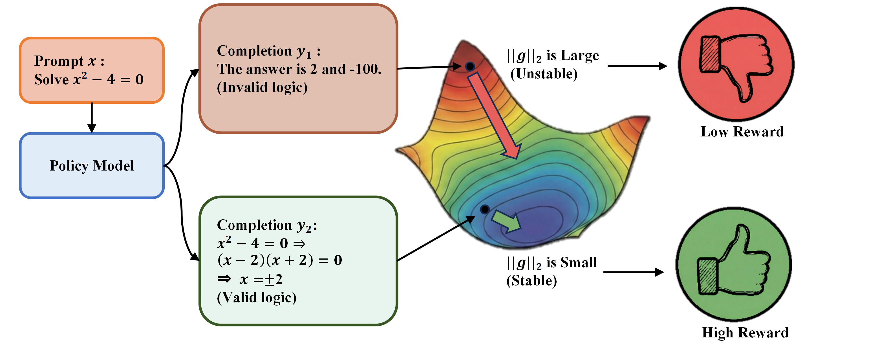

<div align="center">

# VIGOR: Verifier-Free RL for LLMs via Intrinsic Gradient-Norm Reward

<!-- [](https://ZJUSCL.github.io/XXX/)
[](https://arxiv.org/abs/XXX.XXX)
[](https://huggingface.co/collections/ZJUSCL/XXX)
[](https://huggingface.co/datasets/ZJUSCL/XXX) -->
</div>


## 📖 Introduction

This is the official implementation for the paper: Verifier-Free RL for LLMs via Intrinsic Gradient-Norm Reward.

VIGOR is a verifier-free intrinsic reward for RL post-training that rewards completions with smaller per-sample gradient norms, stabilized by a $\sqrt{T}$ length correction and rank-based normalization.


<p align="center">
  
</p>


## 📰 News
- **[2026-04]** 🎉 Our paper has been accepted to Findings of ACL 2026.
- **[2026-01]** 🎉 We initialize the official code of VIGOR.

<!-- TODO List -->
<!-- ## 🚧 TODO List
- [x] Release training dataset -->
<!-- - [ ] Release better model -->

<!-- ## 📄 Table of Contents
- [🛠️ Installation](#%EF%B8%8F-installation-)
- [🏋️ Training](#🏋️-training)
- [📊 Benchmark](#📊-benchmark)
- [🖊️ Citation](#%EF%B8%8F-citation-)
- [🤝 Acknowledgement](#-acknowledgement-) -->

---

## 🚀 Quick Start

### 💻 Installation
To run the code in this project, first, create a Python virtual environment using e.g. `uv`.
To install `uv`, follow the [UV Installation Guide](https://docs.astral.sh/uv/getting-started/installation/).
```bash
INSTALL_PROFILE=gpu SKIP_GIT_LFS_SMUDGE=1 ./scripts/setup_venv.sh 3.11.13 && source .venv/bin/activate

# If your environment gets into a bad state, do a clean rebuild:
rm -rf .venv .uv-cache
```

<!-- ### 🚀 Usage

#### Basic Command
```python
xxxx
``` -->

---


### 📁 Dataset

```bash
# Install huggingface_hub for dataset download
pip install huggingface_hub

# Download MATH dataset
huggingface-cli download DigitalLearningGmbH/MATH-lighteval --local-dir ./data/MATH

# Donwload CodeContests dataset

```

## 🏋️ Training

### 🤖 Model Support

- **Qwen2.5-3B**
- **Qwen2.5-7B** 

### 🚀 Training Command

```bash
# training Qwen2.5-3B on MATH
bash ./training_scripts/run_3B_48G.sh
# training Qwen2.5-7B on MATH
bash ./training_scripts/run_7B_80G.sh
```

---

## 📊 Benchmark
### Evaluation Setup

We evaluate different benchmarks using their official or commonly-used toolchains:

- **GSM8K & MATH500**: evaluated with **[LightEval](https://github.com/huggingface/lighteval)**.  
- **LiveCodeBench v6**: evaluated with the **[LiveCodeBench](https://github.com/LiveCodeBench/LiveCodeBench)**.  
- **CRUX**: evaluated with **[CRUXEval](https://github.com/facebookresearch/cruxeval)**.  
- **MMLU-Pro & IFEval**: evaluated with **[lm-evaluation-harness](https://github.com/EleutherAI/lm-evaluation-harness)**.  
- **AMC**: evaluated using the scripts from **[Spurious_Rewards](https://github.com/ruixin31/Spurious_Rewards/tree/main/code/ttrl)**.

### Results
Here we report results for Qwen2.5-7B-Base trained on the MATH dataset. We use greedy decoding (temperature = 0) and report pass@1 for all datasets; for AMC, we set temperature = 0.6 and report avg@8 for stability.

| Model           | Supervision |     GSM8K |   MATH500 |       AMC | Math Avg. | LiveCodeBench |      CRUX | Code Avg. |  MMLU-Pro |    IFEval |
| --------------- | ----------- | --------: | --------: | --------: | --------: | ------------: | --------: | --------: | --------: | --------: |
| Qwen2.5-7B-Base | None        |     43.06 |     63.00 |     21.68 |     42.58 |          1.99 |     17.38 |      9.69 |     47.21 |     35.90 |
| w/ GT-Reward    | ${q,a}$     |     84.80 |     74.60 |     42.01 |     67.14 |          7.39 |     55.50 |     31.45 |     43.17 |     34.63 |
| w/ INTUITOR     | ${q}$       |     87.19 | **76.20** |     35.99 |     66.46 |         19.81 | **57.20** |     38.51 |     43.04 |     34.91 |
| w/ VIGOR (Ours) | ${q}$       | **88.70** | **76.20** | **44.42** | **69.77** |     **24.45** |     56.38 | **40.42** | **43.09** | **37.03** |


<!-- ---


## 📚 Citation

Please kindly cite our paper if you use our code, data, models or results:

```bibtex
@article{
}
```

---

## 🙏 Acknowledgements

We would like to thank the xxx. -->
